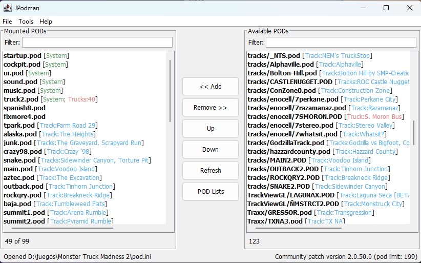

# JPodman

JPodman is a Java 17 Swing tool for managing Monster Truck Madness 1 & 2 `pod.ini` POD file mount lists.



## Features

- Dual-list POD manager for moving POD files between mounted and available lists, including double-click add/remove.
- Startup loading dialog while initial POD lists are read and scanned.
- Name filters above both mounted and available POD lists.
- Reads and writes MTM/TRI `pod.ini` files.
- Creates a new `pod.ini` when one does not already exist.
- Discovers `.pod` files in the game folder and configured extra POD folders.
- Configurable active POD limit, defaulting to 99, with preset buttons for MTM1, MTM2 trial/retail, MTM2 patched, and community patch setups.
- POD metadata labels using POD parsing: tracks are detected from `.SIT` files and trucks from `.TRK` files.
- Displays track, truck, system, and missing-file tags in POD lists.
- User-configurable system POD files, displayed ahead of detected metadata, such as `truck2.pod [System; Trucks:40]`.
- Exports the current mounted POD list without modifying the game `pod.ini`.
- Optional save-and-launch workflow for `monster.exe` (retail) or `monsterx.exe` (trial).
- Reads `monster.exe` / `monsterx.exe` ProductVersion metadata on Windows through JNA when available.
- Reads optional `system/monster.ini` `podLimit` values added by community patches.
- Shows detected/suggested POD limit information in the status bar as a warning only.
- Preferences dialog with JSON storage in the user's OS-specific config folder.
- Monster.ini Fonts & Settings editor for custom fonts, localization file, extra horn, latency display, and hidden track settings.
- Saved POD List Manager with dual-list editing, `pod.ini` import, current-mounted list capture, missing-file validation, and one-click mounting.
- Windows-only registry info and reset tools using JNA-based registry access.
- JNA registry support targets the 32-bit Windows registry view used by MTM1 & 2.

## Build And Run

```sh
mvn test
mvn package
java -jar target/jpodman.jar
```

## Behavior

- The app starts even when the selected folder has no `monster.exe`, `monsterx.exe`, or `pod.ini`.
- Missing `pod.ini` loads as an empty mount list. Saving creates `pod.ini` if the folder is writable.
- If saving fails, JPodman warns that no data was persisted and keeps the in-memory list intact.
- The standard active POD limit is 99. Change it from `Tools > Preferences`.
- The active limit is controlled only by the user preference.
- Detected executable ProductVersion data and `system/monster.ini` `podLimit` values are warning/read-only hints and do not enforce the active limit.
- `File > Export POD List` writes a readable text export without changing the game `pod.ini`.
- Saved POD lists use the same available POD inventory and metadata labels as the main window.
- Missing POD files in saved lists are marked as `[missing]` and are discarded, after a warning, when using that list.
- Imported `pod.ini` saved lists are de-duplicated case-insensitively.
- Double-clicking an item in either main POD list or Saved POD List Manager list performs the natural add/remove action.

## Preferences

Preferences are stored as JSON in the user's config folder:

- macOS: `~/Library/Application Support/JPodman/preferences.json`
- Windows: `%APPDATA%/JPodman/preferences.json`
- Linux/Unix: `$XDG_CONFIG_HOME/JPodman/preferences.json` or `~/.config/JPodman/preferences.json`

The preferences file stores the POD limit, extra POD folders, folder scan depth, sort mode, always-on-top mode, system POD file names, view mode, and saved POD lists.

Default system POD files are:

- `startup.pod`
- `cockpit.pod`
- `ui.pod`
- `sound.pod`
- `truck2.pod`
- `music.pod`

---

## License

This project is licensed under the Apache License 2.0. See [LICENSE](./LICENSE).
